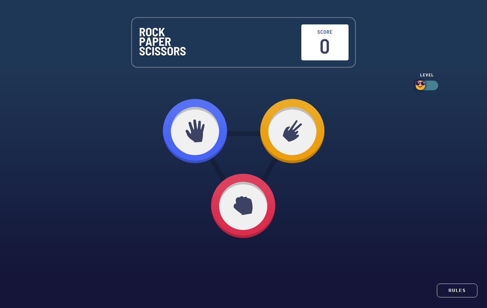
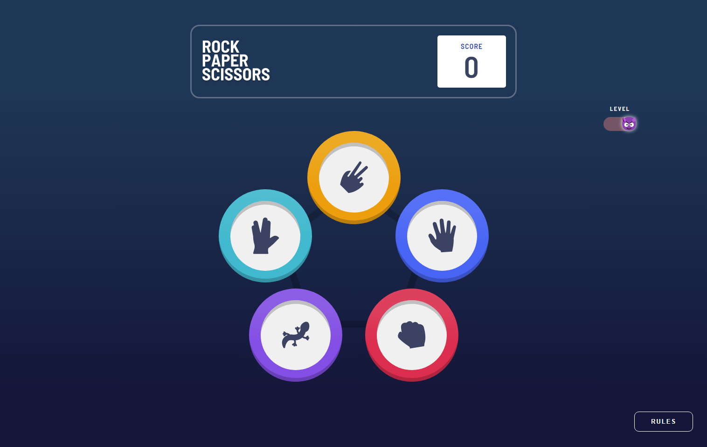
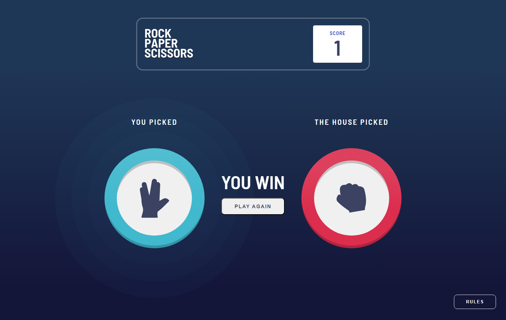
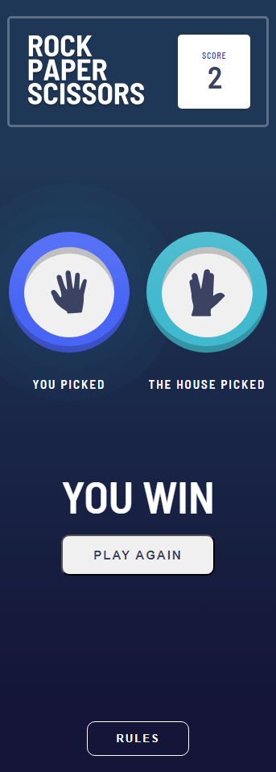

# Rock-Paper-Scissors Game 🎮

## 📚 Table of contents

- [About the project](#about-the-project)
- [Features](#features)
- [Built with](#built-with)

## About the project
This project is a modern, responsive Rock-Paper-Scissors game where the user plays against the computer. The goal is to provide a fun and user-friendly experience across all devices, whether it's a mobile phone, tablet, or desktop computer.

## Features
🎮 **Classic Mode**: The player can choose from the traditional three options – rock, paper, or scissors.

💡 **Advanced Mode**: If the player finds the classic mode too easy or boring, they can switch to a harder version with just one click. In this mode, there are five choices, such as rock, paper, scissors, lizard, and spock.

💾 **Auto Saving**: Scores are saved in localStorage, so they persist between sessions

📱 **Fully Responsive Design**: The game layout and controls adapt seamlessly to any screen size, ensuring an optimal user experience on all devices.

❓ **Rules Popup**: Players can click the "Rules" button at any time to view the detailed rules of the current game mode.

## Built with

- HTML5
- SCSS
- JavaScript

---

> This is a solution to the [Rock, Paper, Scissors challenge on Frontend Mentor](https://www.frontendmentor.io/challenges/rock-paper-scissors-game-pTgwgvgH). Frontend Mentor challenges help you improve your coding skills by building realistic projects.
